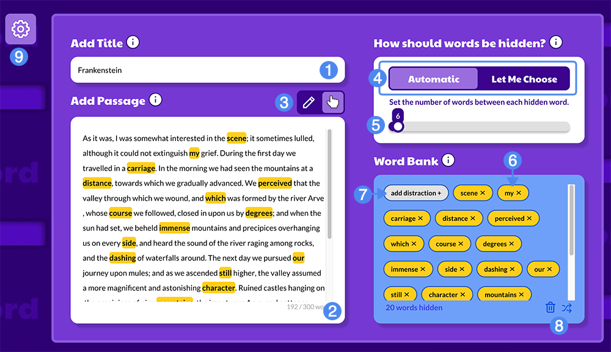

## Overview ##

Create fill-in-the-blank activities from any passage with the Word Guess widget! Let's take a brief tour of the creator interface to get you started.

When you initialize the creator for the first time, an introductory dialog will highlight the key steps to creating a Word Guess widget. Let's walk through each. Notably, only the title and passage inputs will be available initially.

### Add a Title

Every Materia widget needs a title: use this input to provide one. A good title allows you and your students to quickly identify this particular Word Guess activity.

### Add (or paste) a Passage of Text

Enter the passage text for your Word Guess activity in the large text area below the title. This can be a snippet from a literary work, a technical document, an essay, or anything else that's relevant to your course content. Note that Word Guess imposes a 300-word limit on text passages to ensure the activity is not overwhelming for students.

Once a text passage is entered, the remainder of the creator becomes available.

### Select How Words Should Be Hidden

At the top-right, a slider allows you to choose between **Automatic** word selection or **Let Me Choose**:

* Automatic: Words are automatically selected at a particular frequency. Note that low-value words such as conjunctions are skipped.
* Let Me Choose: You are responsible for selecting the words that will be hidden to students. Bear in mind there is a maximum number of selected words.

### Choose the Words a Student Must Guess

If **Let Me Choose** is selected, you can now click individual words in the passage to mark them as hidden. These words are highlighted and appear in the Word Bank on the bottom right. Note that you can still select words even if **Automatic** is selected, however doing so will switch the selection mode to **Let Me Choose**.

When **Automatic** is selected, the slider underneath the toggle allows you to adjust the **frequency of hidden words** in the passage. When **Let Me Choose** is selected, the slider turns into a bar that provides insight into the ratio of hidden words to total word count. Above a certain number of hidden words, the bar will transition to yellow, indicating there may be too many hidden words for the activity to be instructionally effective. Selecting additional words will eventually turn the bar red, with an accompanying error message, indicating the total number of hidden words has been reached.

<aside>
	At any time, you can choose to edit the passage text of the widget. Doing so may remove certain words from the word bank if they are no longer present. Clicking within the passage text area will toggle it back to edit mode, and clicking outside of the passage text area will transition it back to word selection mode. You can always switch between the two modes manually by clicking the toggle switch above the passage text input area.
</aside>

### (Optional) Add Distractor Words

You can add additional words to the Word Bank that are not selected from the passage text: these will appear in the Word Bank in the Player, and add a level of additional nuance to your activity. Students will be notified of the number of distractor words present in the Word Bank when the player is first initialized.

### (Optional) Scoring and Response Type Settings

By default, Word Guess scoring is enabled to assess a student's response to each blank. The student's score is calculated based on the percentage of words that are placed in the correct location in the passage text. When **Enable Scoring** is deselected, Word Guess will always yield a 100% score as a participation indicator.

You can also choose between two response types:

* Word Bank: This is the default, intended way to play Word Guess. Hidden words are displayed in the Word Bank for students to see and drag into the passage text.
* Free Response: The hidden words are replaced by text inputs, and the word bank is disabled. Students are expected to enter text into each input. This option is included to support earlier versions of Word Guess, which relied on this response type.

> Scoring can be enabled for free response Word Guess widgets, but it is not recommended.

Now that we've reviewed the individual steps of creating your Word Guess widget, let's take a quick tour of the interface:

1. Title text
2. Passage text
3. Passage edit & word selection toggle
4. Word selection toggle: Automatic or Let Me Choose
5. Word selection slider (or indicator for Let Me Choose mode)
6. A word selected to be hidden in the Word Bank
7. Add a distraction word
8. Word bank controls
9. View optional settings
