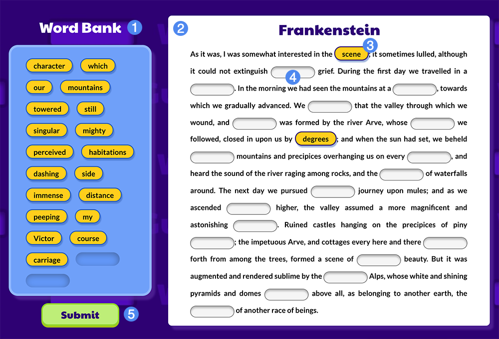
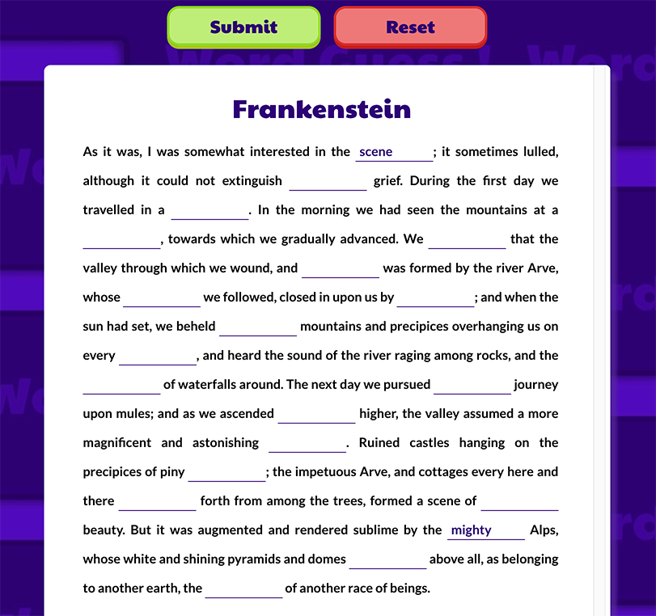

## Overview ##

**Word Guess** is an activity that tasks the student with filling in the blanks of a text passage. Depending the widget, these may be **pre-determined words in a word bank** or text fields that you populate with words of your choosing.

1. Bank of unguessed words *(Note: not present in free response)*
2. Text passage
3. Word positioned in a blank slot
4. Blank slot/hidden word

### Playing Word Guess

When a **Word Bank** (1) is present, simply drag and drop words from the word bank into the appropriate empty slot in the text passage. You can also use **tab** to quickly traverse the list of individual words, and **enter/return** to pick up a word. Use **tab** again to traverse the list of empty slots and **enter/return** a second time to place the word.

Some Word Guess widgets may contain additional "distractor" words. Students will be notified of the number of distractor words present when the widget initializes. These appear as additional words in the word bank, resulting in leftover words when all blanks are filled in the text passage.

#### Free Response

If a word bank is not present, the widget is in free response mode. Instead of a predetermined set of words to place in the passage text, students are expected to fill in each blank with the text they expect would occupy the space.

### Scoring

Word Guess will score students' performance by default, based on the placement of correct words in their respective spaces. The score screen will indicate whether a word was placed in a correct location. Unguessed words will not display the correct answer. In **free response mode**, scoring is based on whether the text for a given input matches the hidden word.

Note that instructors can disable scoring for Word Guess. If the score overview is not present on the score screen, the widget is not scored beyond a participation value of 100%.